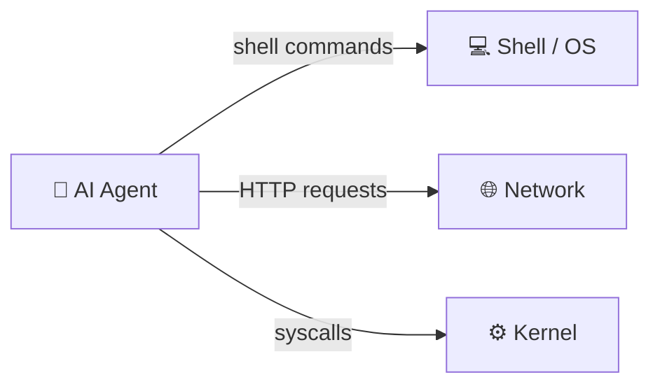
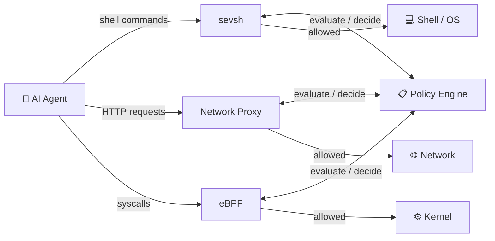

# 🛡️ Sevorix Watchtower (Lite)

> **Runtime Containment for Autonomous AI Agents.**
> *Zero-Latency. Action-Centric. Rust-Native.*

  

Most developers think an "AI Gateway" is enough. But if your agent gets a raw shell command or a direct network socket, it bypasses the gateway entirely. Sevorix Lite is an open-source, local runtime firewall that enforces an inescapable **Action Authorization Boundary** on your AI agents. 

It intercepts, records, and blocks dangerous/undesirable activity in < 20ms. What is considered dangerous and undesirable is completely up to you!

---

## ⚡ Quick Start (Under 60 Seconds)

### 1. Download and install

**Linux / WSL:**
```bash
VERSION=$(curl -s https://api.github.com/repos/sevorix/sevorix-lite/releases/latest | grep tag_name | cut -d'"' -f4)
curl -L https://github.com/sevorix/sevorix-lite/releases/download/${VERSION}/sevorix-${VERSION}-x86_64-linux.tar.gz | tar -xz
cd sevorix-${VERSION}-x86_64-linux && ./install-binary.sh
```

**macOS (Apple Silicon):**
```bash
VERSION=$(curl -s https://api.github.com/repos/sevorix/sevorix-lite/releases/latest | grep tag_name | cut -d'"' -f4)
curl -L https://github.com/sevorix/sevorix-lite/releases/download/${VERSION}/sevorix-${VERSION}-aarch64-darwin.tar.gz | tar -xz
cd sevorix-${VERSION}-aarch64-darwin && ./install-binary.sh
```

**macOS (Intel):**
```bash
VERSION=$(curl -s https://api.github.com/repos/sevorix/sevorix-lite/releases/latest | grep tag_name | cut -d'"' -f4)
curl -L https://github.com/sevorix/sevorix-lite/releases/download/${VERSION}/sevorix-${VERSION}-x86_64-darwin.tar.gz | tar -xz
cd sevorix-${VERSION}-x86_64-darwin && ./install-binary.sh
```

Or download directly from the [releases page](https://github.com/sevorix/sevorix-lite/releases/latest).

### 2. Verify the download (optional)

To verify the integrity of the archive before installing, download and check the SHA256 checksum:

```bash
# Linux
sha256sum -c sevorix-${VERSION}-x86_64-linux.tar.gz.sha256
# macOS
shasum -a 256 -c sevorix-${VERSION}-aarch64-darwin.tar.gz.sha256
```

### 3. Start the Daemon
Launch the Sevorix Control Plane in the background.
```bash
sevorix start
sevorix status
```

### 4. Open the Watchtower Dashboard
Navigate to your local command center to see real-time enforcement:
👉 **`http://localhost:3000/dashboard/desktop.html`**

---

### Install from source

**Linux/WSL** — builds with full eBPF support:
```bash
git clone https://github.com/sevorix/sevorix-lite.git
cd sevorix-lite
./install.sh
```

**macOS** — builds proxy + policy engine only (no eBPF, no libseccomp required):
```bash
git clone https://github.com/sevorix/sevorix-lite.git
cd sevorix-lite
cargo build --release
cp target/release/sevorix target/release/sevsh ~/.local/bin/
```

---

## 🏎️ The Test Drive: See it in Action

Don't trust us. Test it. We've included `sevsh`, a secure shell wrapper that routes commands through the Sevorix engine before they ever hit the processor. 

Leave your Dashboard open in a browser, and run these in your terminal:

### Scenario 1: The Green Lane (Allowed)
Run a benign command.
```bash
sevsh -c "echo 'Agent is thinking...'"
```
**Result:** The command executes normally.

### Scenario 2: The Red Lane (Zero-Latency Kill Switch)
Simulate a rogue agent trying to drop a database table. Our default `policies.json` strictly forbids the `DROP` keyword.
```bash
sevsh -c "DROP TABLE users;"
```
**Result:** The command is instantly vaporized. You will see `SEVORIX BLOCKED: Policy Violation` in your terminal.

### Scenario 3: The Yellow Lane (Human-in-the-Loop)
Simulate an agent trying to access sensitive data. Our default policy flags the `SELECT` keyword for human review.
```bash
sevsh -c "SELECT * FROM admin_credentials;"
```
**Result:** The terminal hangs. Switch to your **Dashboard**. You will see a Yellow Intervention Panel with a countdown timer. Click **Block** or **Allow** to determine the outcome.

---

## 🤖 AI Agent Integrations (The Vault)

Sevorix isn't just for manual testing. We integrate directly with your favorite autonomous coding agents to put them in a secure sandbox. 

Currently supporting **Claude Code** (with Codex and OpenClaw in active development).

> See **[docs/INTEGRATIONS.md](docs/INTEGRATIONS.md)** for full usage, internals, and per-tool guides.

### Securing Claude Code
When you start Claude Code through Sevorix, we use a Linux mount namespace to bind-mount `sevsh` over `/bin/bash`. This means even if Claude uses an absolute path to try and bypass security, it hits our inescapable lock.

**1. Install the Integration:**
```bash
sevorix integrations install claude
```
*(Note: This just checks prerequisites; it does not modify your system config).*

**2. Launch Claude in the Vault:**
```bash
sevorix integrations start claude
```

**3. Pass Arguments seamlessly:**
```bash
sevorix integrations start claude -- /path/to/project --resume
```

Claude is now running. Any command it attempts to execute will be intercepted, evaluated against your policies, and governed by Sevorix. 

---

## ⚙️ How it Works: The Architecture

### Without Sevorix

An AI agent has unrestricted access to your system. Shell commands, network requests, and syscalls execute directly — with no interception, no audit trail, and no way to stop a rogue or compromised agent before it causes damage.



### With Sevorix

Every action the agent takes passes through the Sevorix enforcement plane before it can reach the system. Actions are evaluated in real time against your policies, and blocked, flagged, or allowed accordingly.



#### Components

| Component | Role |
|-----------|------|
| **sevsh** | A secure shell wrapper that intercepts every command before it reaches the OS. Used directly in the Test Drive, and bind-mounted over `/bin/bash` inside the Claude Code vault so there is no escape path. |
| **Network Proxy** | An HTTP proxy running on the Sevorix daemon. Intercepts all outbound agent HTTP/S requests before they leave the machine. |
| **eBPF** | A kernel-level syscall interceptor (Linux only, `ebpf` feature). Catches raw syscalls that bypass the shell and network layers entirely. |
| **Policy Engine** | Consulted by each interceptor before a call is passed or rejected. Evaluates the action against your loaded policies (Simple / Regex / Executable) and returns Allow, Block, or Flag. |

### macOS vs Linux

The macOS binary ships the proxy, policy engine, sevsh, and the dashboard. The two Linux-only subsystems — eBPF and seccomp — are not available on macOS because they depend on Linux kernel APIs.

| Capability | macOS | Linux/WSL |
|-----------|:-----:|:---------:|
| HTTP proxy + policy enforcement | ✓ | ✓ |
| sevsh shell interception (text patterns) | ✓ | ✓ |
| Dashboard + WebSocket | ✓ | ✓ |
| Claude Code integration | ✓ | ✓ |
| SevorixHub client | ✓ | ✓ |
| Human-in-the-loop Yellow Lane | ✓ | ✓ |
| Shell syscall filtering (seccomp) | — | ✓ |
| Kernel network interception (eBPF) | — | ✓ |
| Per-process syscall tracing (eBPF) | — | ✓ |

**What this means in practice:** On macOS, if an AI agent bypasses the HTTP proxy — for example, by opening a raw TCP socket — Sevorix cannot see that traffic. On Linux with eBPF, such bypasses are caught at the kernel level. For most developer workflows on a Mac the proxy layer is sufficient; the eBPF layer provides deeper containment for production or adversarial environments.

`Syscall`-context policies are accepted by the policy engine on macOS but will never trigger (there is no syscall interception layer to feed them). Use `Shell` or `Network` context for policies you want enforced on Mac.

---

Sevorix Watchtower relies on physics, not suggestions. We enforce a **Three-Lane Traffic** system:

1.  **🔴 Red Lane (The Block):** Deterministic kills. SQL Injection, Data Exfiltration, Financial Theft. (Latency: ~0ms).
2.  **🟡 Yellow Lane (Intervention):** Ambiguous intent **held** for operator review. Request is suspended until Allow/Block decision or timeout.
3.  **🟢 Green Lane (The Pass):** Approved patterns passed with zero overhead.

### Customizing Permissions

Permissions are created using two constructs: roles and policies. A policy is a rule for blocking or flagging activity, and a role is a collection of policies. By default during installation you will have a default role and policy set installed. The defaults are **NOT** a comprehensive or particularly useful set of rules, but rather a tool for validating your install and starting point for creating real, effective rule sets.

#### Policy JSON Schema

```json
{
  "id": "unique-policy-id",
  "type": "Simple",
  "pattern": "DROP TABLE",
  "action": "Block",
  "context": "Shell",
  "kill": false
}
```

| Field     | Type             | Description |
|-----------|------------------|-------------|
| `id`      | string           | Unique identifier (kebab-case recommended) |
| `type`    | enum             | `Simple`, `Regex`, or `Executable` |
| `pattern` | string           | The match pattern (see match types below) |
| `action`  | enum             | `Block`, `Flag`, or `Allow` |
| `context` | enum             | `Shell`, `Network`, `Syscall`, or `All` (default: `All`) |
| `kill`    | bool             | If true, kill the traced process instead of returning EPERM. Use only for critical violations. |
| `syscall` | string \| array  | *(Syscall context only)* Syscall name(s) to intercept. See **Syscall-context policies** below. |

#### Match Types

- **`Simple`** — Substring match (case-sensitive). Fast and predictable.
  ```json
  { "type": "Simple", "pattern": "DROP TABLE" }
  ```

- **`Regex`** — Full Rust regex match. Compiled once and cached.
  ```json
  { "type": "Regex", "pattern": "(?i)(drop|delete|truncate)\\s+table" }
  ```

- **`Executable`** — Pipes the content to an external command via stdin; blocks if exit code is 0. Powerful but slow — use sparingly and only for complex logic that Simple/Regex can't express.
  ```json
  { "type": "Executable", "pattern": "grep -qi 'wire.*funds'" }
  ```
  > **Security warning**: Always review executable policies published on SevorixHub before pulling.
  >
  > **Security warning — `path` field is attacker-controlled**: For `Syscall`-context `Executable` policies, the `path` field in the stdin JSON is read from the supervised process's memory — the supervised process controls its value and can embed shell metacharacters or injection payloads (e.g. `$(rm -rf ~)`). Checker binaries must treat `path` as untrusted: parse JSON programmatically (e.g. `path=$(jq -r .path); rm -- "$path"`) and never interpolate it directly into a shell command.

#### Actions

| Action  | Meaning |
|---------|---------|
| `Block` | Hard reject. |
| `Flag`  | Soft reject — marks the action for review and pauses execution. |
| `Allow` | Explicit permit — overrides nothing but documents intent. |
> Flag doesn't work well with Syscall yet, and will post a message to the user but block the syscall without an option for allowing.

#### Policy Context

Scope policies to specific interception layers:

| Context   | When it applies |
|-----------|-----------------|
| `Shell`   | Agent shell commands intercepted before execution |
| `Network` | Outbound HTTP requests through the proxy |
| `Syscall` | Low-level syscall interception (eBPF feature) |
| `All`     | All contexts (default) |

Use `context` to avoid false positives — e.g., a policy blocking `DELETE` should use `context: "Network"` if you only want to block HTTP DELETE methods, not shell `delete` commands.

#### Syscall-context policies

Syscall policies intercept raw kernel calls from within a `sevsh` session using seccomp-unotify. The process is suspended mid-syscall, evaluated against the policy, and either allowed or denied before the kernel executes the call.

**The `syscall` field** names which syscall(s) to intercept:

| Match type    | `syscall` required? | What it does |
|---------------|---------------------|--------------|
| `Simple`      | No (optional)       | If absent, `pattern` is the syscall name. If set, the named syscall(s) are always blocked. |
| `Regex`       | **Yes**             | Regex is matched against the path argument of the syscall (e.g., the file being deleted). |
| `Executable`  | **Yes**             | External command receives JSON syscall info on stdin; exit 0 = block. |

`syscall` accepts a single name or an array to cover multiple syscall variants:
```json
"syscall": "unlink"
"syscall": ["unlink", "unlinkat", "rmdir"]
```

> ⚠️ **Startup fails** if a `Regex` or `Executable` policy has `context: "Syscall"` but no `syscall` field. This is intentional — Sevorix cannot silently drop a security rule.

**Examples:**

Block all file deletion (`rm` uses `unlinkat` on modern Linux — cover both variants):
```json
{ "id": "block-file-deletion", "type": "Simple", "action": "Block", "context": "Syscall", "syscall": ["unlink", "unlinkat", "rmdir"] }
```

> **Important:** `rm` calls `unlinkat` (syscall 263), not `unlink` (syscall 87), on modern Linux.
> A policy with only `"pattern": "unlink"` will not block `rm`.

Block deletion and renaming of files under `/etc/`:
```json
{
  "id": "protect-etc",
  "type": "Regex",
  "pattern": "^/etc/",
  "action": "Block",
  "context": "Syscall",
  "syscall": ["unlink", "unlinkat", "rename", "renameat", "renameat2"]
}
```

> On modern Linux, `mv` calls `renameat2` (syscall 316) rather than `rename` or `renameat`.
> Omitting `"renameat2"` means `mv /etc/foo /etc/bar` is not intercepted — always include all three
> rename variants when protecting a path from being moved.

**Limitations:**
- Only active inside `sevsh` sessions. Processes not spawned via `sevsh` are not intercepted.
- Filter is compiled at session start — policy changes take effect in new sessions only.
- `Executable` rules block the traced process for the duration of the subprocess call. Use sparingly.
- `Syscall`-context policies are accepted on macOS but never enforced (no seccomp on macOS).

#### Role Schema

Roles group policies and are assigned to agents:

```json
{
  "name": "restricted-agent",
  "policies": ["block-destructive-sql", "block-wire-funds", "flag-admin-ops"],
  "is_dynamic": false
}
```

An agent running with `restricted-agent` will only be evaluated against policies in that role.

#### File Locations

- **Policies**: `~/.sevorix/policies/` — each `.json` file is one policy or an array of policies
- **Roles**: `~/.sevorix/roles/` — each `.json` file is one role or an array of roles

Files are loaded automatically when the daemon starts. No restart needed if you use `sevorix validate` for testing.

---

## 🛠️ CLI Reference
Manage your local enforcement node with the unified `sevorix` CLI.

```bash
sevorix start               # Start daemon
sevorix stop                # Kill daemon
sevorix config check        # Validate your policies.json
sevorix validate "CMD"      # Test a command against rules
sevorix integrations list   # Show available AI sandboxes
```

---

## ⚠️ Common Installation Issues

**1. "command not found: sevorix" or "command not found: sevsh"**
* **The Fix:** Your system doesn't know where the installed binaries are. They are likely in `~/.local/bin`. Run this to add it to your path:
  `export PATH=$PATH:~/.local/bin`
  *(Tip: Add that line to your `~/.bashrc` or `~/.zshrc` file to make it permanent).*

**2. Port 3000 is already in use**
* **The Fix:** The Sevorix Watchtower dashboard runs on port 3000 by default. If you have a React or Node.js app running in the background, Sevorix might fail to start. Kill the process using port 3000, then run `sevorix start` again. Support for designating a port other than the default 3000 coming soon.

**3. Permission Denied during Claude Code Integration**
* **The Fix:** When you run `sevorix integrations start claude`, Sevorix uses a Linux mount namespace to safely lock the agent down. This requires temporary `sudo` privileges. Ensure your user has sudo rights, or check that the installer successfully placed the rule in `/etc/sudoers.d/sevorix-claude`.

**4. macOS: daemon does not start on login**
* **The Fix:** The daemon does not integrate with launchd automatically. To start Sevorix on login, create `~/Library/LaunchAgents/com.sevorix.watchtower.plist`:
  ```xml
  <?xml version="1.0" encoding="UTF-8"?>
  <!DOCTYPE plist PUBLIC "-//Apple//DTD PLIST 1.0//EN" "http://www.apple.com/DTDs/PropertyList-1.0.dtd">
  <plist version="1.0"><dict>
      <key>Label</key><string>com.sevorix.watchtower</string>
      <key>ProgramArguments</key><array>
          <string>/Users/YOUR_USER/.local/bin/sevorix</string>
          <string>run</string>
      </array>
      <key>RunAtLoad</key><true/>
      <key>KeepAlive</key><true/>
      <key>StandardOutPath</key><string>/tmp/sevorix.log</string>
      <key>StandardErrorPath</key><string>/tmp/sevorix.err</string>
  </dict></plist>
  ```
  Then run `launchctl load ~/Library/LaunchAgents/com.sevorix.watchtower.plist`.

**5. macOS build error: `could not find library 'seccomp'`**
* **The Fix:** This occurs when building from source before the `libseccomp` dependency is gated as Linux-only in `sevorix-core`. As a temporary workaround, move the dependency in `sevorix-core/Cargo.toml`:
  ```toml
  [target.'cfg(target_os = "linux")'.dependencies]
  libseccomp = "0.4"
  ```
  Pre-built macOS binaries from the releases page do not have this issue.

---

**License:** Open source under the AGPL-3.0 license. For commercial or enterprise use, contact `chris@sevorix.com`.